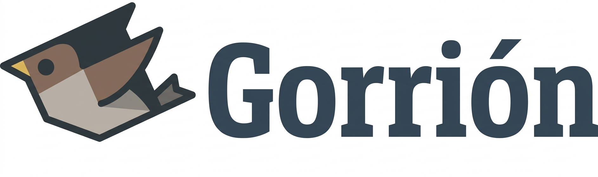

<p align="center">
  
</p>

<p align="center">
  <a href="https://hex.pm/packages/gorrion"></a>
  <a href="https://hex.pm/packages/gorrion"></a>
  <a href="https://hex.pm/packages/gorrion"></a>
</p>

Ecto-like driver-agnostic database migration library for Gleam.

Reads plain `.sql` files from a directory, tracks applied migrations in a `_schema_migrations` table, and supports forward migration and rollback.

Works with any [common_sql](https://hex.pm/packages/common_sql) driver — SQLite, PostgreSQL, or any future driver.

## Installation

Add gorrion and a driver to your project:

```sh
gleam add gorrion
gleam add common_sql_sqlite       # for SQLite
# or: gleam add common_sql_postgresql  # for PostgreSQL
```

Or manually in your `gleam.toml`:

```toml
[dependencies]
gorrion = ">= 0.1.0 and < 1.0.0"
common_sql_sqlite = ">= 1.0.3"   # or common_sql_postgresql
```

## Migration file convention

Place your SQL files in a `migrations/` directory (outside `src/` to avoid squirrel conflicts):

```
your_project/
  migrations/
    001_create_users.sql          # up migration (required)
    001_create_users_down.sql     # rollback (optional)
    002_add_email_to_users.sql
    003_create_orders.sql
    003_create_orders_down.sql
```

- **Up**: `{NNN}_{name}.sql` — the migration SQL to apply
- **Down**: `{NNN}_{name}_down.sql` — optional rollback SQL. If missing, rollback will only remove the tracking record without running any SQL.

The version number `NNN` can be any integer (e.g., `001`, `042`, `20240101`). Migrations are applied in version order.

## Usage

```gleam
import common_sql as sql
import common_sql_sqlite  // or common_sql_postgresql
import gorrion
import gorrion/types

pub fn main() {
  let driver = common_sql_sqlite.driver()

  use conn <- sql.with_connection(driver, "./myapp.db") {

  // Run all pending migrations
  case gorrion.migrate(driver:, conn:, migrations_dir: "migrations") {
    Ok(Nil) -> io.println("Done")
    Error(types.MigrationFailed(version:, name:, reason:)) ->
      io.println("Migration " <> int.to_string(version) <> " failed: " <> reason)
    Error(types.FileError(reason)) ->
      io.println("File error: " <> reason)
    Error(types.QueryError(reason)) ->
      io.println("Query error: " <> reason)
  }
}
```

## API

### `gorrion.migrate(driver:, conn:, migrations_dir:)`

Runs all pending migrations in version order. Skips migrations already recorded in `_schema_migrations`.

### `gorrion.rollback(driver:, conn:, migrations_dir:)`

Rolls back the most recently applied migration. Executes the `_down.sql` file if it exists, otherwise just removes the tracking record.

### `gorrion.rollback_to(driver:, conn:, migrations_dir:, target_version:)`

Rolls back all migrations above `target_version` in reverse order.

### `gorrion.status(driver:, conn:, migrations_dir:)`

Returns a `MigrationStatus` with lists of applied and pending migrations:

```gleam
case gorrion.status(driver:, conn:, migrations_dir: "migrations") {
  Ok(status) -> {
    io.println("Applied: " <> int.to_string(list.length(status.applied)))
    io.println("Pending: " <> int.to_string(list.length(status.pending)))
  }
  Error(_) -> io.println("Could not read status")
}
```

## Types

```gleam
// A migration loaded from disk
type Migration {
  Migration(version: Int, name: String, up: String, down: String)
}

// A migration that has been applied (from _schema_migrations)
type AppliedMigration {
  AppliedMigration(version: Int, name: String, applied_at: String)
}

// Status report
type MigrationStatus {
  MigrationStatus(applied: List(AppliedMigration), pending: List(Migration))
}

// Error types
type MigrationError {
  QueryError(String)
  MigrationFailed(version: Int, name: String, reason: String)
  RollbackFailed(version: Int, name: String, reason: String)
  NoMigrationsToRollback
  FileError(String)
}
```

## How it works

1. Scans the migrations directory for `*.sql` files (excluding `*_down.sql`)
2. Creates `_schema_migrations` table if it doesn't exist
3. Compares file versions against recorded versions
4. Applies pending migrations in order, recording each in `_schema_migrations`

The `_schema_migrations` table:

```sql
CREATE TABLE _schema_migrations (
  version INTEGER PRIMARY KEY,
  name TEXT NOT NULL,
  applied_at TEXT NOT NULL DEFAULT CURRENT_TIMESTAMP
);
```
